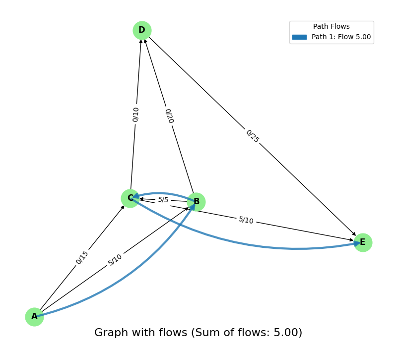
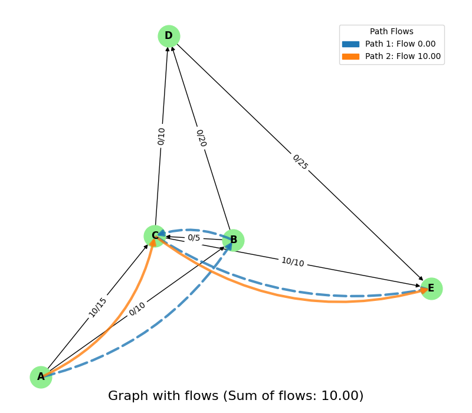
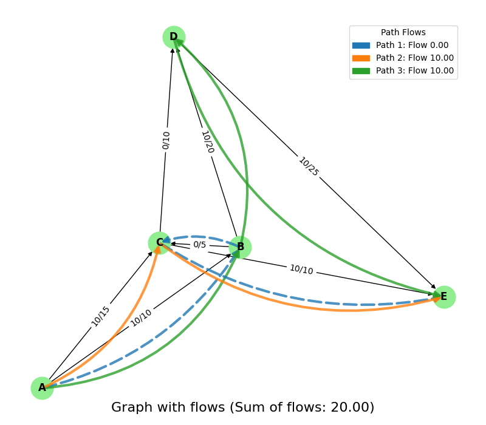
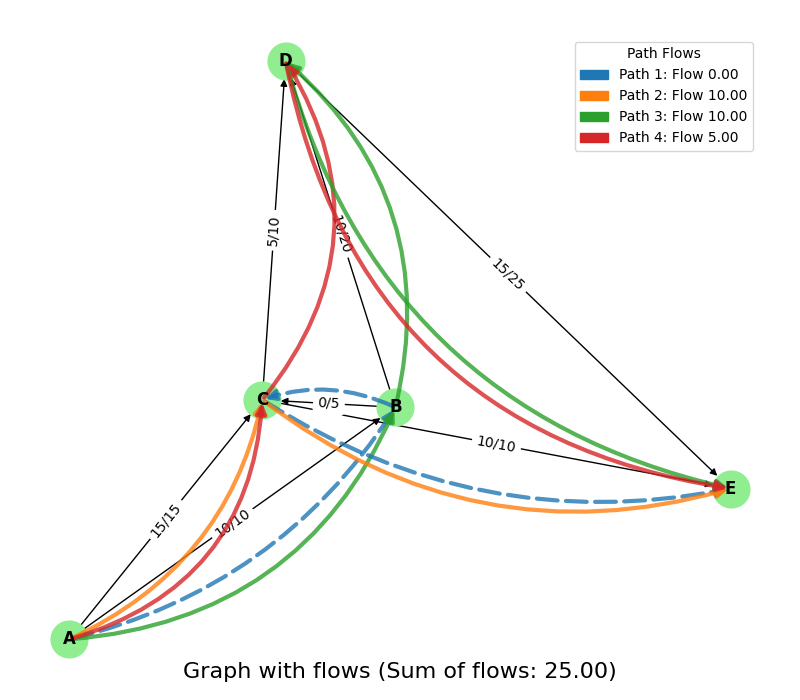

# Cutting sticks

- Usage : `python3 cutting_sticks.py`

```python
from utils.col_gen_cut_stirck import column_generation

L = 259
l = [81, 70, 68]
b = [44, 3, 48]

A, final_solution, final_obj_value = column_generation(L, l, b)

print("===============================================================")
print("最终模式矩阵 A:")
print(A)
print("最终解 x:", final_solution)
print("最终目标值:", final_obj_value)

```

- Output :
```
==================================================
[N.1 RLPM problem] :
['x1', 'x2', 'x3']
min x1 + x2 + x3
st1 : x1*1.0 >= 44.0
st2 : x2*1.0 >= 3.0
st3 : x3*1.0 >= 48.0
-----------------------------------------------
x =  [44.0, 3.0, 48.0]
min(x1 + x2 + x3) =  95.0
-----------------------------------------------
pi =  [1. 1. 1.]
z =  [0. 0. 3.]
reduced cost = 1 - <pi, z> =  -2.0
==================================================
[N.2 RLPM problem] :
['x1', 'x2', 'x3', 'x4']
min x1 + x2 + x3 + x4
st1 : x1*1.0 >= 44.0
st2 : x2*1.0 >= 3.0
st3 : x3*1.0 + x4*3.0 >= 48.0
-----------------------------------------------
x =  [44.0, 3.0, 0.0, 16.0]
min(x1 + x2 + x3 + x4) =  63.0
-----------------------------------------------
pi =  [1.         1.         0.33333333]
z =  [0. 3. 0.]
reduced cost = 1 - <pi, z> =  -2.0
==================================================
[N.3 RLPM problem] :
['x1', 'x2', 'x3', 'x4', 'x5']
min x1 + x2 + x3 + x4 + x5
st1 : x1*1.0 >= 44.0
st2 : x2*1.0 + x5*3.0 >= 3.0
st3 : x3*1.0 + x4*3.0 >= 48.0
-----------------------------------------------
x =  [44.0, 0.0, 0.0, 16.0, 1.0]
min(x1 + x2 + x3 + x4 + x5) =  61.0
-----------------------------------------------
pi =  [1.         0.33333333 0.33333333]
z =  [3. 0. 0.]
reduced cost = 1 - <pi, z> =  -2.0
==================================================
[N.4 RLPM problem] :
['x1', 'x2', 'x3', 'x4', 'x5', 'x6']
min x1 + x2 + x3 + x4 + x5 + x6
st1 : x1*1.0 + x6*3.0 >= 44.0
st2 : x2*1.0 + x5*3.0 >= 3.0
st3 : x3*1.0 + x4*3.0 >= 48.0
-----------------------------------------------
x =  [0.0, 0.0, 0.0, 16.0, 1.0, 14.666666666666666]
min(x1 + x2 + x3 + x4 + x5 + x6) =  31.666666666666664
-----------------------------------------------
pi =  [0.33333333 0.33333333 0.33333333]
z =  [0. 0. 3.]
reduced cost = 1 - <pi, z> =  0.0
===============================================================
最终模式矩阵 A:
[[1. 0. 0. 0. 0. 3.]
 [0. 1. 0. 0. 3. 0.]
 [0. 0. 1. 3. 0. 0.]]
最终解 x: [ 0.  0.  0. 16.  1. 15.]
最终目标值: 32.0
```

# Path Generation


- Usage : `python3 path_generation.py`

```python
from utils.col_gen_path_generation import column_generation
import numpy as np

V = ['A', 'B', 'C', 'D', 'E']

E = [('A', 'B'), ('A', 'C'), ('B', 'C'), ('B', 'D'), ('C', 'D'), ('C', 'E'), ('D', 'E')]

Pd = [
    [1],  # A -> B
    [0],  # A -> C
    [1],  # B -> C
    [0],  # B -> D
    [0],  # C -> D
    [1],  # C -> E
    [0],  # D -> E
]

d = ['A', 'E']

Cap_E = [10,
         15,
         5,
         20,
         10,
         10,
         25
]

Pd0 = np.array(Pd)

Pd, final_solution, final_obj_value = column_generation(d, V, E, Cap_E, Pd0)

print("===============================================================")
print("Final Pattern Matrix:")
print(Pd)

print("Final Solution:")
print(final_solution)

print("Final Objective Value:")
print(final_obj_value) 
```

- Results:

[//]: # (在一行中依次插入rlmp四张图, 并且保证它们均分屏幕宽度)
<div style="display: flex; justify-content: space-between;">
    
    
    
    
</div>


| Iteration | Variables ($xp$) | Objective Value ($obj\_fct\_val$) | Dual Variables ($\pi$)                                                                                             | New Pattern ($p\_new\_binary$) | Reduced Cost ($r_q$) | Updated Pattern Matrix            |
|-----------|-------------------|---------------------------|----------------------------------------------------------------------------------------------------------------------|--------------------------|--------------------|-------------------------------------|
| 1         | $[5]$           | 5                         | $[1\mathrm{e}{-6}, 1\mathrm{e}{-6}, 0.999998, 1\mathrm{e}{-6}, 1\mathrm{e}{-6}, 1\mathrm{e}{-6}, 1\mathrm{e}{-6}]$   | $[0, 1, 0, 0, 0, 1, 0]$        | 0.999998          | $\begin{bmatrix}1 & 0 \\ 0 & 1 \\ 1 & 0 \\ 0 & 0 \\ 0 & 0 \\ 1 & 1 \\ 0 & 0 \end{bmatrix}$ |
| 2         | $[0, 10]$   | 10                        | $[1\mathrm{e}{-6}, 1\mathrm{e}{-6}, 1\mathrm{e}{-6}, 1\mathrm{e}{-6}, 1\mathrm{e}{-6}, 0.999999, 1\mathrm{e}{-6}]$ | $[1, 0, 0, 1, 0, 0, 1]$        | 0.999997          | $\begin{bmatrix}1 & 0 & 1 \\ 0 & 1 & 0 \\ 1 & 0 & 0 \\ 0 & 0 & 1 \\ 0 & 0 & 0 \\ 1 & 1 & 0 \\ 0 & 0 & 1 \end{bmatrix}$ |
| 3         | $[0, 10, 10]$| 20                        | $[0.999998, 1\mathrm{e}{-6}, 1\mathrm{e}{-6}, 1\mathrm{e}{-6}, 1\mathrm{e}{-6}, 0.999999, 1\mathrm{e}{-6}]$        | $[0, 1, 0, 0, 1, 0, 1]$        | 0.999997          | $\begin{bmatrix}1 & 0 & 1 & 0 \\ 0 & 1 & 0 & 1 \\ 1 & 0 & 0 & 0 \\ 0 & 0 & 1 & 0 \\ 0 & 0 & 0 & 1 \\ 1 & 1 & 0 & 0 \\ 0 & 0 & 1 & 1 \end{bmatrix}$ |
| 4         | $[0, 10, 10, 5]$| 25                        | $[0.999998, 0.999998, 1\mathrm{e}{-6}, 1\mathrm{e}{-6}, 1\mathrm{e}{-6}, 2\mathrm{e}{-6}, 1\mathrm{e}{-6}]$        | $[0, 1, 0, 0, 0, 1, 0]$        | 0.0                | $\begin{bmatrix}1 & 0 & 1 & 0 \\ 0 & 1 & 0 & 1 \\ 1 & 0 & 0 & 0 \\ 0 & 0 & 1 & 0 \\ 0 & 0 & 0 & 1 \\ 1 & 1 & 0 & 0 \\ 0 & 0 & 1 & 1 \end{bmatrix}$ |

### Final Results
- **Final Pattern Matrix:**
  \[
  \begin{bmatrix}
  1 & 0 & 1 & 0 \\
  0 & 1 & 0 & 1 \\
  1 & 0 & 0 & 0 \\
  0 & 0 & 1 & 0 \\
  0 & 0 & 0 & 1 \\
  1 & 1 & 0 & 0 \\
  0 & 0 & 1 & 1
  \end{bmatrix}
  \]
- **Final Solution:** $[0.0, 10.0, 10.0, 5.0]$
- **Final Objective Value:** 25.0

```
==================iter [ 1 ]======================
xp =  [5.0]
obj_fct_val =  5.0
==================================================
[N.1 RLPM problem] :
['xp1']
max xp1
st1 : xp1*1.0 <= 10.0
st2 :  <= 15.0
st3 : xp1*1.0 <= 5.0
st4 :  <= 20.0
st5 :  <= 10.0
st6 : xp1*1.0 <= 10.0
st7 :  <= 25.0
-----------------------------------------------
xp =  [5.0]
max(xp1) =  5.0
-----------------------------------------------
pi =  [1.00000e-06 1.00000e-06 9.99998e-01 1.00000e-06 1.00000e-06 1.00000e-06
 1.00000e-06]
p_new_binary =  [0, 1, 0, 0, 0, 1, 0]
reduced cost = 1 - <pi, p_new> =  0.999998
[[1 0]
 [0 1]
 [1 0]
 [0 0]
 [0 0]
 [1 1]
 [0 0]]
==================iter [ 2 ]======================
xp =  [0.0, 10.0]
obj_fct_val =  10.0
==================================================
[N.2 RLPM problem] :
['xp1', 'xp2']
max xp1 + xp2
st1 : xp1*1.0 <= 10.0
st2 : xp2*1.0 <= 15.0
st3 : xp1*1.0 <= 5.0
st4 :  <= 20.0
st5 :  <= 10.0
st6 : xp1*1.0 + xp2*1.0 <= 10.0
st7 :  <= 25.0
-----------------------------------------------
xp =  [0.0, 10.0]
max(xp1 + xp2) =  10.0
-----------------------------------------------
pi =  [1.00000e-06 1.00000e-06 1.00000e-06 1.00000e-06 1.00000e-06 9.99999e-01
 1.00000e-06]
p_new_binary =  [1, 0, 0, 1, 0, 0, 1]
reduced cost = 1 - <pi, p_new> =  0.999997
[[1 0 1]
 [0 1 0]
 [1 0 0]
 [0 0 1]
 [0 0 0]
 [1 1 0]
 [0 0 1]]
==================iter [ 3 ]======================
xp =  [0.0, 10.0, 10.0]
obj_fct_val =  20.0
==================================================
[N.3 RLPM problem] :
['xp1', 'xp2', 'xp3']
max xp1 + xp2 + xp3
st1 : xp1*1.0 + xp3*1.0 <= 10.0
st2 : xp2*1.0 <= 15.0
st3 : xp1*1.0 <= 5.0
st4 : xp3*1.0 <= 20.0
st5 :  <= 10.0
st6 : xp1*1.0 + xp2*1.0 <= 10.0
st7 : xp3*1.0 <= 25.0
-----------------------------------------------
xp =  [0.0, 10.0, 10.0]
max(xp1 + xp2 + xp3) =  20.0
-----------------------------------------------
pi =  [9.99998e-01 1.00000e-06 1.00000e-06 1.00000e-06 1.00000e-06 9.99999e-01
 1.00000e-06]
p_new_binary =  [0, 1, 0, 0, 1, 0, 1]
reduced cost = 1 - <pi, p_new> =  0.999997
[[1 0 1 0]
 [0 1 0 1]
 [1 0 0 0]
 [0 0 1 0]
 [0 0 0 1]
 [1 1 0 0]
 [0 0 1 1]]
==================iter [ 4 ]======================
xp =  [0.0, 10.0, 10.0, 5.0]
obj_fct_val =  25.0
==================================================
[N.4 RLPM problem] :
['xp1', 'xp2', 'xp3', 'xp4']
max xp1 + xp2 + xp3 + xp4
st1 : xp1*1.0 + xp3*1.0 <= 10.0
st2 : xp2*1.0 + xp4*1.0 <= 15.0
st3 : xp1*1.0 <= 5.0
st4 : xp3*1.0 <= 20.0
st5 : xp4*1.0 <= 10.0
st6 : xp1*1.0 + xp2*1.0 <= 10.0
st7 : xp3*1.0 + xp4*1.0 <= 25.0
-----------------------------------------------
xp =  [0.0, 10.0, 10.0, 5.0]
max(xp1 + xp2 + xp3 + xp4) =  25.0
-----------------------------------------------
pi =  [9.99998e-01 9.99998e-01 1.00000e-06 1.00000e-06 1.00000e-06 2.00000e-06
 1.00000e-06]
p_new_binary =  [0, 1, 0, 0, 0, 1, 0]
reduced cost = 1 - <pi, p_new> =  0.0
===============================================================
Final Pattern Matrix:
[[1 0 1 0]
 [0 1 0 1]
 [1 0 0 0]
 [0 0 1 0]
 [0 0 0 1]
 [1 1 0 0]
 [0 0 1 1]]
Final Solution:
[ 0. 10. 10.  5.]
Final Objective Value:
25.0

进程已结束，退出代码为 0

```